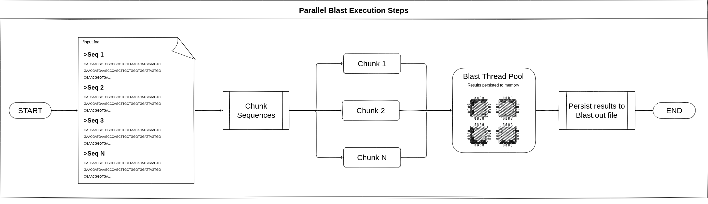

# BLUTILS

The `Blutils` tool allow user to run and generate consensus identities of Blast
results. Currently the BlastN is available.

## Installation

`Blutils` package could be installed directly from
[crates.io](https://crates.io/crates/blutils) using cargo:

```bash
cargo install blutils
```

After installed, `Blutils` could be evoked using the `blu` command.

```bash
blu --help
```

The output should be close to:

```bash
A utility to make it easier to run and analyze Blast results

Usage: blu <COMMAND>

Commands:
  blast  Execute the parallel blast and run consensus algorithm
  check  Check `Blutils` dependencies
  help   Print this message or the help of the given subcommand(s)

Options:
  -h, --help     Print help information
  -V, --version  Print version information
```

## Check dependencies

Optionally you could check OS dependencies before run `Blutils`. Naturally BLutils
depends on Ncbi-Blast+ tool to be installed on the host system to perform
parallel blast search. To check if the host OS has these package installed run
the `Blutils` checker for linux systems:

```bash
blu check linux
```

Note: Currently the system check is available only for linux systems and assumes
that dependencies could be evoked directly from terminal.

## Run Blast with Blutils

The `Blutils` execution is simple. To check all available options evoke the
blast subcommand help:

```bash
blu blast run-with-consensus --help
```

After inspect available options, simple run `Blutils` with test data. First
download test data from the project github directory:

```bash
export INPUT_DIR=https://raw.githubusercontent.com/sgelias/blutils/main/test/mock/input
curl ${INPUT_DIR}/query/query.fna > query.fna
curl ${INPUT_DIR}/query/ref_databases/mock-16S.fna > mock-16S.fna
curl ${INPUT_DIR}/query/ref_databases/mock-16S_taxonomies.tsv > mock-16S_taxonomies.tsv
```

Then run `Blutils`:

```bash
blu blast run-with-consensus \
    query.fna \
    mock-16S.fna \
    mock-16S_taxonomies.tsv \
    output \
    -t 6 \
    --taxon bacteria \
    --strategy relaxed \
    -f
```

Seems the above commands, the output files could be found in output directory
which will contains two additional files named `blast.out` and
`blutils.consensus.json`. The first contains default Blast tabular response and
the former, the Blutils response, which will be close to:

```bash
[
  {
    "query": "NR114924.257984.Bac",
    "taxon": {
      "rank": "class",
      "taxid": 1760,
      "percIdentity": 100.0
    }
  },
  {
    "query": "NR025123.135626.Bac",
    "taxon": {
      "rank": "species",
      "taxid": 135626,
      "percIdentity": 100.0
    }
  },
  {
    "query": "INVALID_SEQUENCE",
    "taxon": null
  }
]
```

### Blast execution

Blast execution try to reaches the full available CPU saturation. At the default
multithread blast execution mode, the full saturation is not reached. To run
Blast through `Blutils` it is possible. All the steps taken during this process
can be seen in the image below.



### Consensus generation

Different from consensus generations from [QIIME
2](https://docs.qiime2.org/2022.11/), the `Blutils` consensus algorithm performs
a data pre-filtering based on Blast results for bit-score and perc-identity,
seems the algorithm described in the image below.


## Next steps

This project contains only basic features to run BlastN and generate consensus
identities. Thus, many features should be created, like create the database
extractor to get data from official NCBI taxdump results and build FASTA
database simultaneously, and others. We welcome new feature suggestions when
needed!
