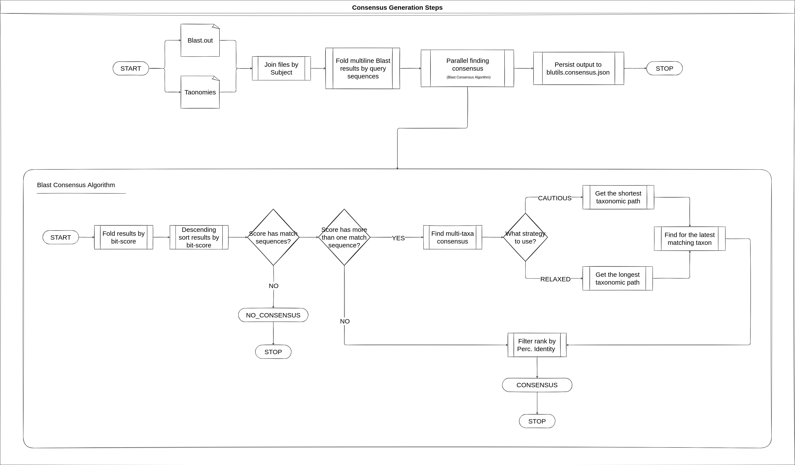

# BLUTILS

`Blutils` (Blast Utils) is a BlastN wrapper developed to execute with hight
performance on improve the native Blast parallelism. The main feature of
`Blutils` is to allow users to generate consensus identities from multi-identity
blast outputs.

## Installation

`Blutils` package could be installed directly from
[crates.io](https://crates.io/crates/blutils-cli) using cargo:

```bash
cargo install blutils-cli
```

After installed, `Blutils` you should evoke it using the `blu` command.

```bash
blu --help
```

The output should be close to:

```bash
The CLI port of the blutils library

Usage: blu [OPTIONS] <COMMAND>

Commands:
  build-db  Build the blast database as a pre-requisite for the blastn command
  blastn    Execute the parallel blast and run consensus algorithm
  check     Check `Blutils` dependencies
  help      Print this message or the help of the given subcommand(s)

Options:
      --log-level <LOG_LEVEL>

      --log-file <LOG_FILE>

      --log-format <LOG_FORMAT>
          [default: ansi]

          Possible values:
          - ansi:  ANSI format
          - jsonl: YAML format

  -t, --threads <THREADS>
          [default: 1]

  -h, --help
          Print help (see a summary with '-h')

  -V, --version
          Print version
```

## Check dependencies

Blutils depends of `Ncbi-Blast+` to be installed on the host system. To check if
the host OS has these package installed run the `Blutils` checker for linux
systems:

```bash
blu check linux
```

Note: Currently the system check is available only for linux systems and assumes
that dependencies could be evoked directly from terminal.

## Run Blast with Blutils

The `Blutils` execution is simple. To check all available options evoke the
blast subcommand help:

```bash
blu blastn run-with-consensus --help
```

After inspect available options, simple run `Blutils` with test data. First
download test data from the project github directory:

```bash
export INPUT_DIR=https://raw.githubusercontent.com/LepistaBioinformatics/blutils/refs/heads/main/test/mock/input
curl ${INPUT_DIR}/query/query.fna > query.fna
curl ${INPUT_DIR}/ref_databases/mock-16S.fna > mock-16S.fna
curl ${INPUT_DIR}/ref_databases/mock-16S_taxonomies.tsv > mock-16S_taxonomies.tsv
```

Then run `Blutils`:

```bash
blu blastn run-with-consensus \
    query.fna \
    mock-16S.fna \
    mock-16S_taxonomies.tsv \
    output \
    -t 6 \
    --taxon bacteria \
    --strategy relaxed \
    -f
```

Seems the above commands, the output files could be found in output directory
which will contains two additional files named `blast.out` and
`blutils.consensus.json`. The first contains default Blast tabular response and
the former, the Blutils response, which will be close to:

```bash
[
  {
    "query": "NR025123.135626.Bac",
    "taxon": {
      "rank": "species",
      "identifier": "shewanella-olleyana",
      "percIdentity": 100.0,
      "bitScore": 2695.0,
      "alignLength": 1459,
      "mismatches": 0,
      "gapOpenings": 0,
      "qStart": 1,
      "qEnd": 1459,
      "sStart": 1,
      "sEnd": 1459,
      "eValue": 0.0,
      "taxonomy": "d__bacteria;p__pseudomonadota;c__gammaproteobacteria;o__alteromonadales;f__shewanellaceae;g__shewanella;s__shewanella-olleyana",
      "mutated": true,
      "consensusBeans": null
    }
  },
  {
    "query": "draft-5123",
    "taxon": {
      "rank": "species",
      "identifier": "bacillus-mojavensis-subgroup",
      "percIdentity": 100.0,
      "bitScore": 815.0,
      "alignLength": 441,
      "mismatches": 0,
      "gapOpenings": 0,
      "qStart": 1,
      "qEnd": 441,
      "sStart": 217,
      "sEnd": 657,
      "eValue": 0.0,
      "taxonomy": "d__bacteria;clade__terrabacteria-group;p__bacillota;c__bacilli;o__bacillales;f__taxid-186817;g__bacillus;species-group__bacillus-subtilis-group;species-subgroup__bacillus-mojavensis-subgroup",
      "mutated": true,
      "consensusBeans": [
        {
          "rank": "species",
          "identifier": "bacillus-halotolerans",
          "occurrences": 5
        },
        {
          "rank": "species",
          "identifier": "bacillus-mojavensis",
          "occurrences": 4
        }
      ]
    }
  },
  {
    "query": "INVALID_SEQUENCE",
    "taxon": null
  }
]
```

### Blast execution

Blast execution try to reaches the full available CPU saturation. At the default
multithread blast execution mode, the full saturation is not reached. To run
Blast through `Blutils` it is possible. All the steps taken during this process
can be seen in the image below.


### Consensus generation

Different from consensus generations from [QIIME
2](https://docs.qiime2.org/2022.11/), the `Blutils` consensus algorithm performs
a data pre-filtering based on Blast results for bit-score and perc-identity,
seems the algorithm described in the image below.



## Next steps

This project contains only basic features to run BlastN and generate consensus
identities. Thus, many features should be created, like create the database
extractor to get data from official NCBI taxdump results and build FASTA
database simultaneously, and others. We welcome new feature suggestions when
needed!
