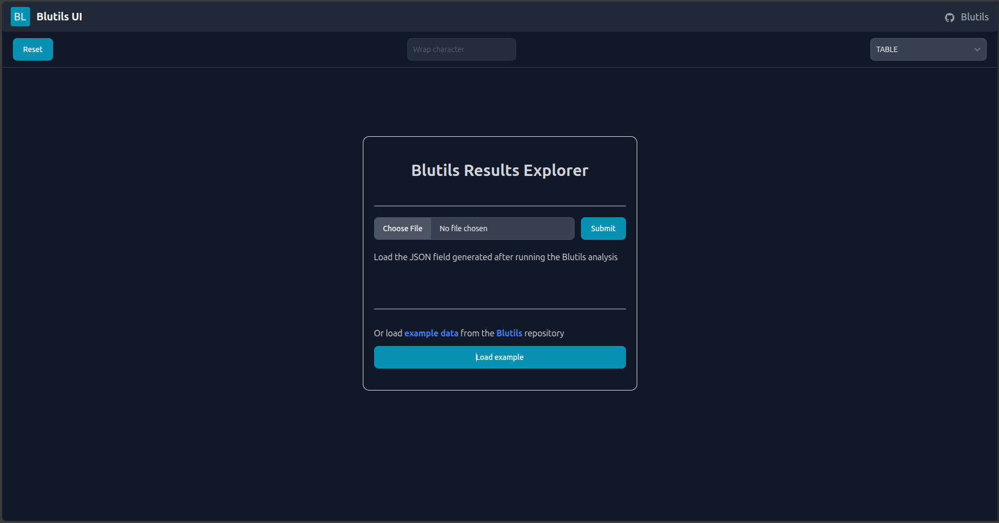
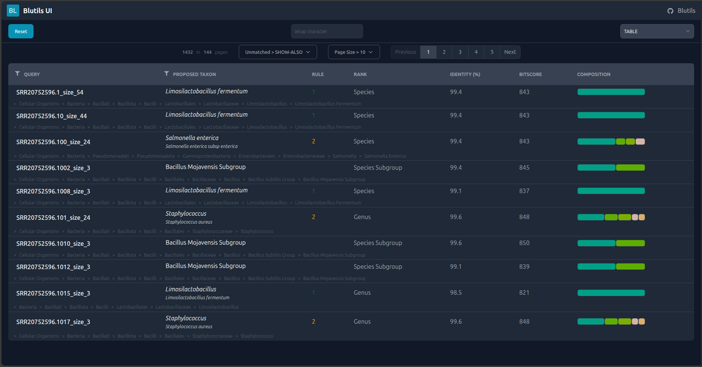
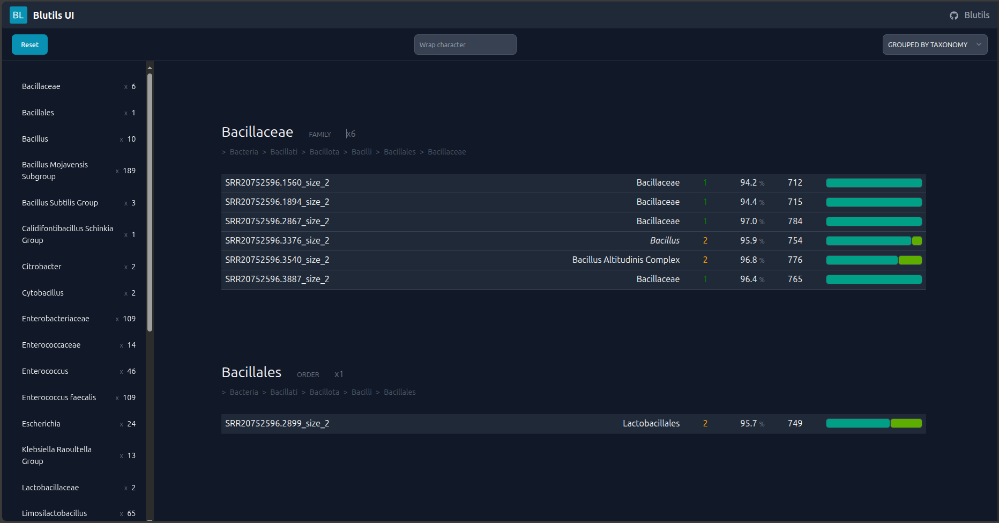
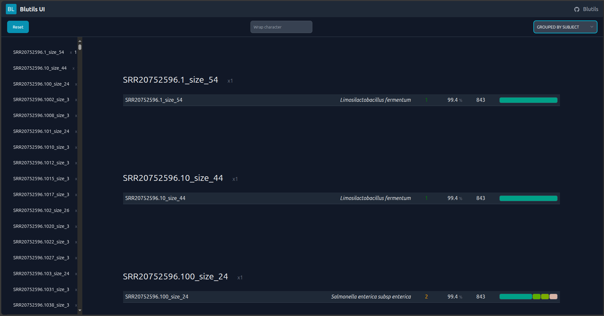
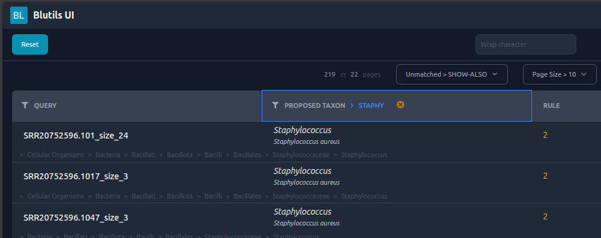
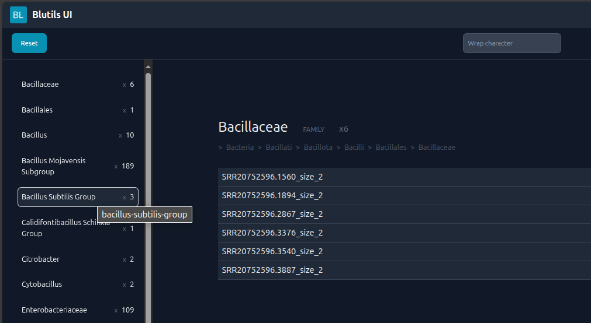
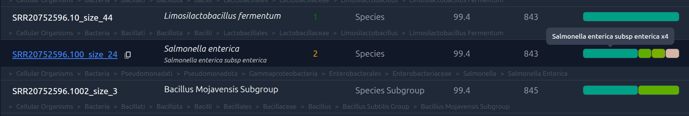
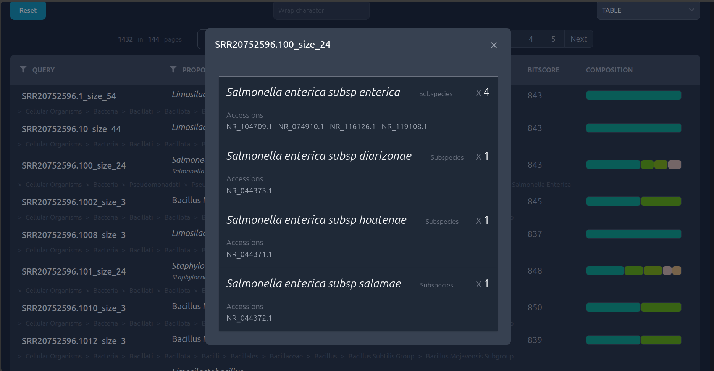

# The Blutils Online Viewer

`Blutils` provides an online viewer to explore the consensus taxonomic
identities
and the blast matches. This is a client-side application that runs in the
browser. "Your data never leaves your computer" is the main motto of the
application.

## Accessing the Blutils Online Viewer

Users can access the Blutils Online Viewer by going to the following URL:

```bash
https://lepistabioinformatics.github.io/blutils-ui/
```

This is the main page of the Blutils Online Viewer:



To see your first results, simple upload the `blutils.out.json` file to the
viewer and click in submit.



`Blutils` include three different view modes:

- Table
- Grouped by taxonomic rank
- Grouped by query sequence

Table is the default view mode and displays the results in a table format.
Grouped by taxonomic rank displays the results in a tree format grouped by
taxonomic rank.



Grouped by query sequence displays the results in a network format grouped by
query sequence.



In tabular view mode, user can apply filters to the query sequences or simple
filter by taxonomic rank.



In grouped by taxonomic rank view mode, user can can navigate through the
taxonomic ranks and see the consensus taxonomic identities and the blast
matches for each taxonomic rank using the left-side panel.



Using the composition chart, users can easily understand why a consensus
identity was selected for a query sequence, just by looking at the distribution
of the query sequences that were assigned to each taxonomic rank.



By clicking in a consensus identity, the viewer will display details about the
blast results used to generate the consensus identity.


